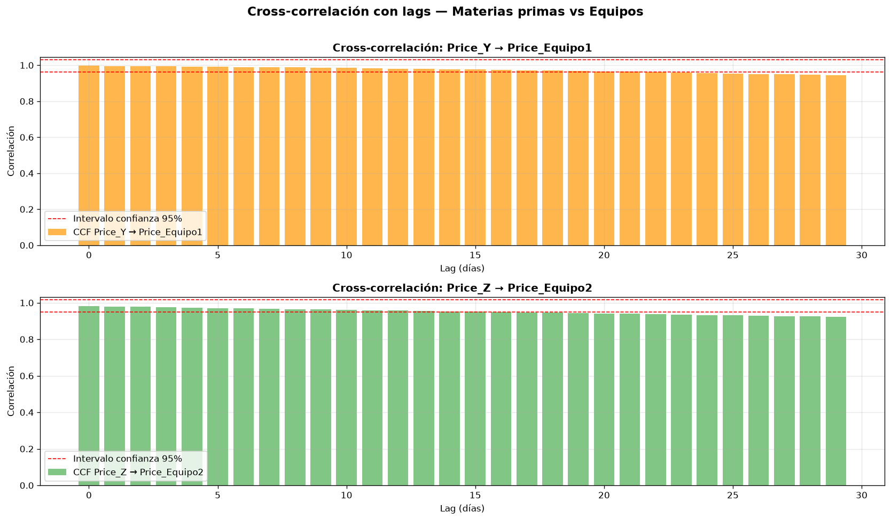
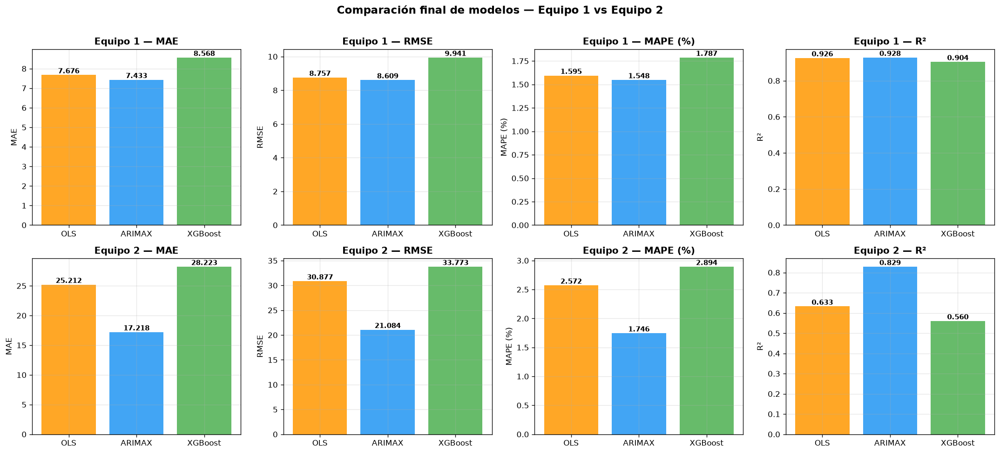
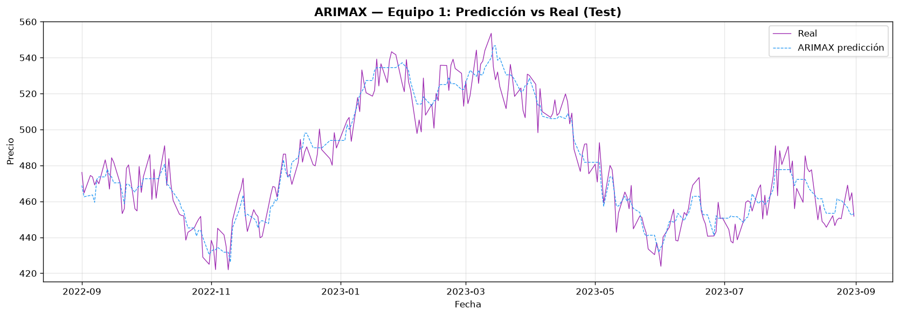
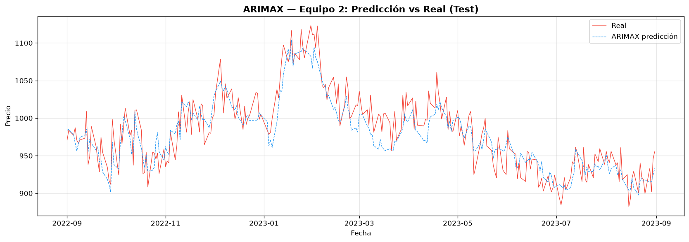
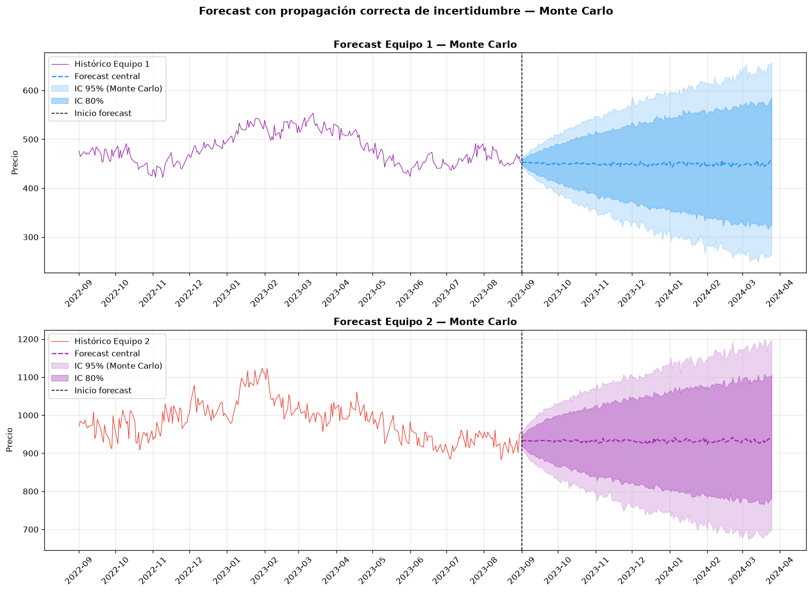
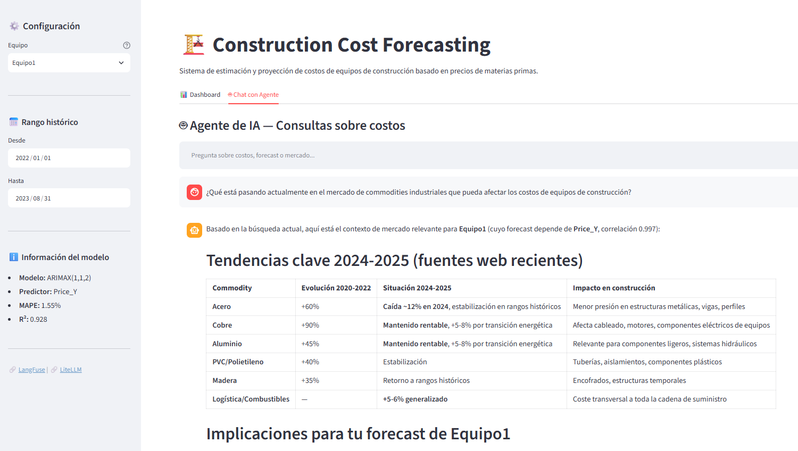
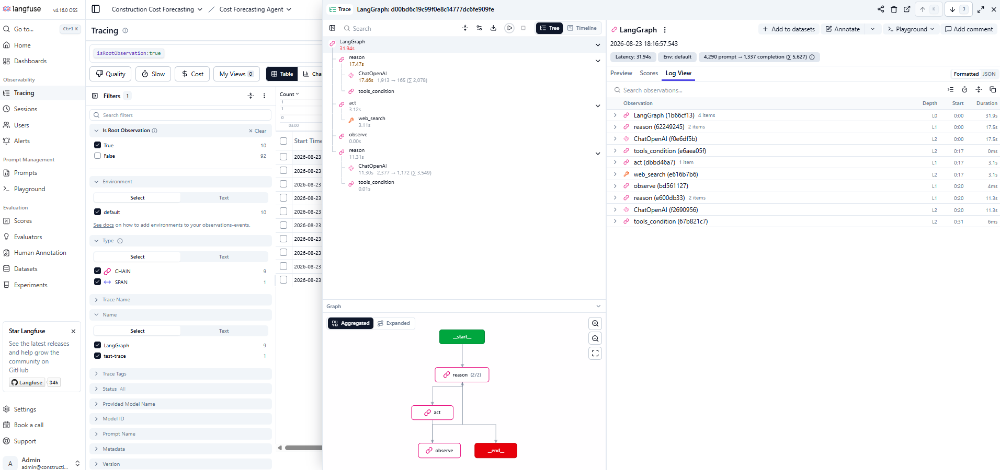
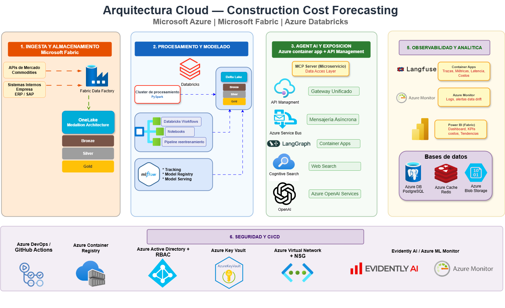

# Informe Técnico: Sistema de Forecasting Financiero para Costos de Construcción
**Autor:** Surley Berrío  
**Fecha:** Agosto 2026  

---
# Fase 1: Modelado Estadístico y Proyección de Costos
## 1. Explicación del caso

Una empresa constructora requiere optimizar el suministro continuo de dos tipos de equipos críticos durante la ejecución de sus proyectos. Históricamente, los costos de adquisición de estos activos han mostrado una alta volatilidad, provocando desviaciones presupuestales recurrentes que afectan la liquidez y planeación financiera de la organización.

La gerencia hipotetiza que los precios de estos equipos están vinculados a la dinámica de ciertos insumos del mercado global de materias primas, pero carecía de un modelo analítico formal para validar dicha relación. Para resolver esto, se dispuso de un histórico de datos con frecuencia diaria (días hábiles) desde enero de 2010 hasta agosto de 2023, que incluye tres materias primas anonimizadas ($X, Y, Z$) y dos equipos específicos ($Equipo 1, Equipo 2$).

**Objetivo del proyecto:** Desarrollar un sistema analítico reproducible que anticipe con precisión los costos de adquisición de los equipos antes del inicio de cada fase constructiva, mitigando el riesgo financiero y blindando el presupuesto operativo.

---

## 2. Supuestos

Para garantizar la viabilidad matemática y económica del desarrollo, se establecieron los siguientes supuestos:

*   **Naturaleza de los Commodities:** Las materias primas $X, Y$ y $Z$ son bienes industriales transados en mercados globales. Aunque no se especificó su naturaleza (ej. acero, aluminio), esto no altera las propiedades estadísticas de las series de tiempo.
*   **Investigación Asistida y Prototipado Rápido:** Debido a las restricciones de tiempo de la prueba, la investigación de la literatura especializada y la comprensión teórica de las dinámicas de precios sectoriales se aceleraron mediante ingeniería de conocimiento asistida por Inteligencia Artificial (utilizando Gemini como experto de dominio). Los supuestos económicos adoptados se fundamentan en este marco sintético de referencia y fueron validados empíricamente con los datos reales.
*   **Representatividad y Calidad de los Datos:** Se asume que los datos históricos reflejan fielmente el comportamiento del mercado real. Los saltos de 3 a 4 días corresponden estrictamente a fines de semana y días festivos, confirmando una granularidad limpia en días hábiles.
*   **Régimen Atípico Post-Pandemia:** El período comprendido entre abril de 2021 y mayo de 2022 se identifica como un choque de oferta estructural y disrupciones logísticas globales post-pandemia. Se asume como un régimen de volatilidad atípica y no como un comportamiento permanente del mercado.
*   **Consistencia de la Información:** Se verificó matemáticamente que el archivo integrado `historico_equipos.csv` guarda una diferencia media de cero frente a las series individuales, garantizando la integridad de la base de datos.

---

## 3. Formas para resolver el caso y la opción tomada en esta prueba

### Enfoques Considerados
Se evaluó un espectro versátil de opciones metodológicas para abordar el problema:

*   **Regresión Lineal Clásica (OLS):** Evaluada como *Baseline* obligatorio. Si un modelo avanzado no supera su rendimiento, la complejidad algorítmica no se justifica.
*   **Modelos de Aprendizaje Profundo (LSTM):** Descartados debido a que la densidad de los datos históricos de series temporales no justifica la sobreparametrización de redes neuronales recurrentes.
*   **Modelos de Machine Learning (XGBoost):** Candidato alternativo para capturar relaciones no lineales complejas mediante *Feature Engineering* (lags, medias móviles y variables dummy para el periodo atípico 2021-2022).
*   **Modelos de Corrección de Errores (VECM/VAR):** Evaluados debido a la naturaleza macroeconómica de los datos, pero condicionados a una alta complejidad de implementación.
*   **Modelos Autorregresivos con Variables Exógenas (ARIMAX):** Identificado como el candidato óptimo tras el análisis de la estructura de las series.

### Opción Tomada y Justificación
Se seleccionó **ARIMAX** como el modelo principal de producción debido a tres hallazgos matemáticos contundentes derivados de los datos:
1.  **No Estacionariedad:** Las pruebas estadísticas confirmaron que las series poseen tendencias dominantes.
2.  **Cointegración Real:** La prueba de Engle-Granger ($p < 0.05$) confirmó una relación económica de largo plazo genuina entre las materias primas y los equipos, descartando correlaciones espurias.
3.  **Relación Contemporánea:** La Función de Correlación Cruzada (CCF) identificó que el impacto máximo ocurre en el rezago cero (Lag 0).

ARIMAX es estadísticamente el método más riguroso para este caso, ya que remueve la tendencia, procesa el impacto de la materia prima exógena y corrige simultáneamente la autocorrelación interna de los residuos mediante sus componentes AR y MA.

---

## 4. Resultados del análisis de los datos y los modelos

### 4.1 Hallazgos del Análisis Exploratorio (EDA)
*   **Calidad:** Cero registros nulos. Se corrigieron problemas de formato en el archivo `Y.csv` (separadores de punto y coma y fechas estructuradas).
*   **Componentes de la Serie:** La descomposición estructural (STL) demostró que la tendencia predomina drásticamente sobre la estacionalidad anual, la cual es de amplitud marginal.
*   **Outliers:** El método de Rango Intercuartílico (IQR) aisló con precisión los límites del período atípico de volatilidad entre abril 2021 y mayo 2022.

### 4.2 Selección de Variables (Filtrado de Señal vs Ruido)
Tras analizar las correlaciones de Pearson, Spearman y el Factor de Inflación de la Varianza (VIF), se emitió el siguiente veredicto:

*   **Price_X ➡️ RUIDO:** Correlación moderada, nula cointegración y un VIF $> 13$ que introducía multicolinealidad severa. Fue **descartada formalmente**.
*   **Price_Y ➡️ SEÑAL EQUIPO 1:** Correlación casi perfecta ($0.997$) y cointegración sólida ($p=0.013$). VIF óptimo de $1.0$ al modelarse en solitario.
*   **Price_Z ➡️ SEÑAL EQUIPO 2:** Correlación robusta ($0.983$) y cointegración sólida ($p=0.008$). VIF óptimo de $1.0$ al modelarse en solitario.

**Decisión de modelado independiente por equipo:**

La evidencia estadística justifica construir **un modelo separado por equipo**
en lugar de un modelo multivariado conjunto, por tres razones:

1. **Ausencia de multicolinealidad:** Price_Y y Price_Z tienen VIF = 1.0
   cuando se usan como única predictora de su equipo respectivo. Combinarlas
   en un solo modelo generaría un VIF de 57-63 — multicolinealidad grave que
   impediría estimar correctamente el efecto individual de cada variable.

2. **Relaciones diferenciadas:** Cada equipo tiene una materia prima dominante
   distinta (Y→Equipo1, Z→Equipo2). Un modelo conjunto mezclaría señales
   de diferente naturaleza, reduciendo la precisión de ambas predicciones.

3. **Parsimonia y trazabilidad:** Modelos simples de una sola predictora son
   más interpretables, más fáciles de monitorear en producción y más fáciles
   de reentrenar cuando lleguen nuevos datos. 


**Gráfico 1: Matriz de Correlación y Análisis de Cointegración (CCF)**



**Análisis de Cointegración (CCF)**

- La correlación es **máxima en lag 0** para ambos pares — el precio
  de la materia prima y el precio del equipo se mueven prácticamente
  en el **mismo día**
- La correlación decae muy lentamente con el lag — sigue siendo
  altísima incluso a 30 días (0.94 y 0.92)
- Esto indica que **no hay un efecto retardado significativo** —
  la relación es contemporánea, no retardada


### 4.3 Evaluación y Comparación de Modelos
El set de datos se dividió respetando estrictamente el orden temporal para evitar filtración de información (*Data Leakage*):
*   **Entrenamiento (Train):** 2010-01-04 a 2022-08-31 ($3,272$ registros).
*   **Validación (Test):** 2022-09-01 a 2023-08-31 ($258$ registros correspondientes a 12 meses completos para evaluar un ciclo anual).

#### Rendimiento en Conjunto de Test:
*   **Equipo 1 (Ganador: ARIMAX 1,1,2):** MAPE de **1.55%** frente al 1.79% de XGBoost. La relación lineal es tan potente que el baseline OLS quedó muy cerca (1.59%).
*   **Equipo 2 (Ganador: ARIMAX 0,1,1):** MAPE de **1.75%** frente al 2.89% de XGBoost y 2.57% de OLS. Aquí el componente temporal MA(1) fue crítico, reduciendo el error en un **32%** frente al baseline.

**Conclusión del Modelado:** XGBoost falló en ambos escenarios debido a su incapacidad intrínseca para extrapolar tendencias fuera del rango de entrenamiento. Los modelos ARIMAX redujeron la incertidumbre presupuestal a niveles más de 10 veces menores que la volatilidad natural de los precios de los equipos.


**Gráfico 2: Comparación de Métricas de Rendimiento - OLS vs ARIMAX vs XGBoost**




### 4.4 Comportamiento de las Predicciones en el Tiempo (Modelo Ganador)
Este comportamiento confirma que el modelo asimiló la estructura autorregresiva de la serie y la señal exógena de las materias primas de manera equilibrada, consolidándose como una herramienta matemática fiable para el negocio.


**Gráfico 3: Curva de Predicción ARIMAX vs Valor Real - Equipo 1**



**Gráfico 4: Curva de Predicción ARIMAX vs Valor Real - Equipo 2**




---

## 5. Proyección de costos y horizonte de predicción

### 5.1 Metodología de Proyección y Corrección Monte Carlo
Dado que las variables predictoras futuros ($Price\_Y$ y $Price\_Z$) son desconocidas en el horizonte de planeación, primero se modelaron mediante algoritmos ARIMA univariados ($ARIMA(1,1,1)$ y $ARIMA(3,1,0)$ respectivamente) para proyectar 147 días hábiles hacia el futuro.

**Ajuste Crítico contra el "Efecto Espejismo":**
Alimentar el modelo ARIMAX utilizando únicamente la predicción puntual (promedio) de las materias primas genera un sesgo peligroso, pues asume que el futuro de los insumos es 100% certero, provocando intervalos de confianza artificialmente estrechos. Para solucionar esto, **se diseñó una simulación Monte Carlo con 1,000 trayectorias** que propaga la incertidumbre de las materias primas directamente al cálculo final de los equipos.

### 5.2 Horizontes de Confianza y Justificación Financiera
Tomando como regla de negocio el coeficiente de variación (CV) histórico como el límite de volatilidad aceptable (Equipo 1: $24.71\%$; Equipo 2: $19.11\%$), se determinó que la incertidumbre de las materias primas abre los intervalos de confianza de los equipos de manera acelerada a partir del segundo mes:

| Horizonte | Temporalidad | Nivel de Confianza | Recomendación Operativa y Financiera |
| :--- | :--- | :--- | :--- |
| **Horizonte Confiable** | Mes 1 (Sep 2023) | **Alta Confianza** | Uso de forecast puntual para compras inmediatas y cierres de contratos. |
| **Horizonte Aceptable** | Meses 2 y 3 | **Moderada** | Uso exclusivo mediante rangos de escenarios para planeación presupuestal general. |
| **Horizonte No Recomendado** | Meses 4 a 7 | **Incertidumbre Excesiva** | No se recomienda su uso operativo debido a la dispersión de las covariables. |

La conclusión medular de este análisis es que el sistema requiere adoptar un esquema de **Pronóstico Móvil (Rolling Forecast) con actualización mensual obligatoria**. Esperar a que transcurra el horizonte de 7 meses sin alimentar el modelo con datos reales expondría a la constructora a un riesgo financiero oculto.


**Gráfico 5: Proyección Final del Forecast a 7 meses con Intervalos de Confianza de Monte Carlo**



---

## 6. Futuros ajustes o mejoras

Con el fin de evolucionar esta primera fase hacia un entorno de producción, se proponen las siguientes líneas de desarrollo:

*   **Validación Cruzada Avanzada:** Implementar un esquema de *Walk-Forward Validation* para simular con precisión matemática el comportamiento del modelo bajo condiciones de actualización mensual continua.
*   **Modelos Volátiles (GARCH):** Integrar modelos de heterocedasticidad condicional autorregresiva para proyectar de forma más fina las bandas de incertidumbre de las materias primas.
*   **Sofisticación Macroeconómica:** Desanonimizar las variables $X, Y, Z$ e incorporar fuentes externas de datos del mercado (como índices de la Cámara de la Construcción o tasas de cambio) para robustecer la precisión del modelo en escenarios de mediano plazo.
*   **Infraestructura de Datos:** Migrar el almacenamiento de archivos CSV planos hacia una base de datos relacional para optimizar los tiempos de cómputo del pipeline.
*   **MLOps y ciclo de vida del modelo:** Implementar un pipeline de   reentrenamiento automático que detecte degradación del modelo via
monitoreo continuo de data drift en Price_Y y Price_Z. Cuando el   MAPE supere el umbral definido (recomendado: 5%), el pipeline
dispara automáticamente el reentrenamiento con los datos más recientes,  registra la nueva versión en MLflow Model Registry y promueve el modelo  a producción solo si supera al modelo anterior en el conjunto de validación. Este ciclo garantiza que el sistema se mantenga preciso sin intervención manual, cerrando el loop entre monitoreo, reentrenamiento y despliegue.

---

## 7. Apreciaciones y comentarios del caso (opcional)

Este caso de estudio refleja con precisión un desafío clásico de la analítica financiera: la tentación de la complejidad. Inicialmente, las correlaciones masivas invitaban a desplegar algoritmos avanzados de Machine Learning como XGBoost; sin embargo, el análisis de datos riguroso demostró que un modelo clásico estructurado con componentes autorregresivos (ARIMAX) captura de forma mucho más eficiente la verdadera dinámica económica de los activos.

La implementación de la simulación Monte Carlo marca el hito más valioso de esta fase, impidiendo que el software subestimara el riesgo y dotando a la gerencia de una herramienta transparente, honesta y calibrada para la toma de decisiones estratégicas.

---

# Informe Técnico — Fase 2: Agente de IA Conversacional
## Sistema de Consultas Inteligentes sobre Costos de Equipos de Construcción

---

## 1. Descripción del componente

La Fase 2 del proyecto implementa un **agente de IA conversacional** diseñado para exponer los resultados del modelado estadístico (Fase 1) mediante una interfaz interactiva en lenguaje natural. El sistema unifica las proyecciones de costos de los equipos con el contexto macroeconómico externo del mercado, permitiendo a los usuarios realizar consultas complejas sobre históricos, tendencias y pronósticos del sector sin requerir conocimientos técnicos previos.

### 🧠 ¿Qué es un Agente de IA vs. IA Convencional?

| Dimensión Analítica | IA Convencional | Agente de IA (Solución Implementada) |
| :--- | :--- | :--- |
| **Flujo de Operación** | Recibe una entrada fija (\(input\)) y genera una respuesta directa (\(output\)). | Ciclo iterativo autónomo: **Razona ➡️ Actúa ➡️ Observa**. |
| **Acceso a Herramientas** | Limitado exclusivamente al conocimiento estático del modelo de lenguaje. | Consume herramientas (*tools*) externas como bases de datos, APIs y entornos web. |
| **Grado de Autonomía** | Ejecución en un solo paso con respuestas directas. | Decide de manera autónoma qué información consultar y en qué orden lógico. |
| **Gestión de Memoria** | Procesamiento aislado sin persistencia de contexto previo. | Mantiene el contexto dinámico y el historial de la sesión del usuario. |
| **Actualización de Datos** | Confinado a la fecha de corte de su ventana de entrenamiento. | Capacidad de buscar e integrar información en tiempo real a través de la web. |

El sistema desarrollado utiliza el patrón arquitectónico **ReAct (Reason + Act)**. El agente evalúa qué herramientas necesita activar según la intención del usuario, ejecuta las consultas requeridas en segundo plano y sintetiza los hallazgos en una respuesta corporativa enriquecida.

---

## 2. Arquitectura del agente

### 2.1 Patrón ReAct (Reason ➡️ Act ➡️ Observe)

El núcleo cognitivo del agente opera bajo un flujo cíclico estructurado que descompone peticiones complejas en pasos lógicos intermedios:

```text
       [ Entrada del Usuario ]
                  ⬇️
       🔄 [Reason] El LLM evalúa la intención y selecciona herramientas
                  ⬇️ (Si requiere datos externos)
       🛠️ [Act]    Ejecución de las Tools seleccionadas en el entorno
                  ⬇️
       📊 [Observe] El Agente absorbe y procesa los resultados de la Tool
                  ⬇️
       🎯 [Reason] Síntesis final de la información recopilada
                  ⬇️
       [ Respuesta Estructurada al Usuario ]
```

Este patrón garantiza que el agente no sufra de alucinaciones severas al responder sobre datos cuantitativos, ya que está obligado a fundamentar sus respuestas en los datos duros recuperados por las herramientas.

### 2.2 Stack Tecnológico

| Componente Crítico | Tecnología Seleccionada | Justificación Arquitectónica |
| :--- | :--- | :--- |
| **Orquestador Central** | **LangGraph** | Estándar de la industria para el desarrollo de agentes con estado (*stateful*). Permite un control absoluto sobre los ciclos y transiciones del grafo. |
| **Gateway de LLMs** | **LiteLLM Proxy** | Puerta de enlace unificada que gestiona el enrutamiento de peticiones, políticas de respaldo (*fallback*), métricas de uso y control estricto de costos. |
| **Modelo Primario** | **NVIDIA Nemotron 4B Ultra** | Modelo avanzado de 550B parámetros optimizado para tareas de razonamiento complejo, patrones ReAct y ventanas extensas de contexto (1M tokens). |
| **Modelo de Respaldo** | **NVIDIA Nemotron 4B Super** | Activación automática vía proxy si el modelo primario experimenta latencia crítica o fallas de disponibilidad (*rate limits*). |
| **Observabilidad** | **Langfuse v4 (Self-Hosted)** | Plataforma empresarial para la trazabilidad completa del grafo. Registra el consumo exacto de tokens, latencias por nodo y auditoría de costos. |
| **Capa de Abstracción**| **FastMCP** | Implementación del *Model Context Protocol* para exponer los datos del negocio como herramientas modulares totalmente desacopladas del almacenamiento. |
| **Extracción Web** | **DuckDuckGo API (ddgs)** | Motor de búsqueda ligero integrado para capturar tendencias actuales del mercado de *commodities* sin costos operativos de licenciamiento. |
| **Interfaz (UI)** | **Streamlit** | Entorno de desarrollo unificado que integra en una sola interfaz el chat conversacional de IA y el dashboard visual del histórico. |
| **Contenerización** | **Docker Compose** | Garantiza la reproducibilidad y el despliegue inmediato del ecosistema unificado (LiteLLM + Langfuse local). |

### 2.3 Catálogo de Herramientas (Tools) del Agente

El agente tiene el control exclusivo sobre cuatro microservicios de datos diseñados bajo el protocolo MCP:

*   `get_forecast_data`: Extrae las proyecciones mensuales de costos junto con sus Intervalos de Confianza (IC) del 95% corregidos previamente mediante la simulación Monte Carlo. Se activa ante consultas sobre **precios futuros**.
*   `get_historical_data`: Recupera las series de precios históricos de los equipos y las materias primas transadas. Se activa ante consultas sobre **comportamiento pasado**.
*   `get_model_metrics`: Expone la tabla comparativa de métricas de rendimiento (OLS, ARIMAX y XGBoost). Se activa ante dudas de los usuarios sobre la **fiabilidad o precisión técnica** del sistema.
*   `web_search`: Realiza un rastreo en vivo de noticias e información macroeconómica sectorial externa. Se activa para contextualizar **tendencias globales actuales**.

### 2.4 MCP Server como Data Access Layer (Capa de Acceso a Datos)

El **MCP Server** (Model Context Protocol) implementa el patrón **Adapter** derivado del diseño guiado por el dominio (*Domain-Driven Design*). Bajo esta arquitectura, el agente opera de forma abstracta y no tiene conocimiento de si los datos provienen de archivos CSV planos, de una base de datos relacional o de una API externa:

```text
Agente LangGraph (Núcleo Cognitivo)
       └── Tool: get_forecast_data
               └── MCP Server (Subproceso vía comunicación stdio)
                       ├── CSVForecastRepository (Fase actual: Prototipo)
                       └── [ PostgreSQL / API Corporativa ] (Fase futura: Producción Azure)
```

> **Justificación de Diseño:** Esta desacoplación estratégica permite migrar el backend de almacenamiento en entornos de producción sin necesidad de modificar una sola línea de código del agente o de la estructura de las herramientas (*tools*).

---

## 3. Decisiones técnicas clave

### 3.1 LiteLLM como Gateway de Modelos (LLM Gateway)

Se desplegó LiteLLM configurado en modo **Proxy Server** independiente (en lugar de integrarlo simplemente como una librería de código). Esto habilita las siguientes capacidades de nivel empresarial:

*   **Enrutamiento Inteligente:** Centraliza y distribuye de forma óptima las peticiones hacia los proveedores disponibles.
*   **Tolerancia a Fallos (Fallback Automático):** Si el modelo de lenguaje principal experimenta latencia o caídas, el gateway redirige la petición al modelo secundario en milisegundos y sin interrumpir la experiencia del usuario.
*   **Auditoría de Consumo (Token Tracking):** Registra minuciosamente la cantidad de tokens de entrada y salida consumidos en cada interacción.
*   **Gestión de Costos:** Calcula el impacto financiero estimado de las consultas del agente, incluso operando sobre capas de prueba gratuitas.
*   **Sincronización Nativa con Telemetría:** Despacha métricas e historiales de uso de manera automática hacia Langfuse sin requerir inyección de código adicional.

```yaml
# litellm/config.yaml
model_list:
  - model_name: nvidia-nemotron-ultra-free    # Infraestructura del Modelo Primario
    litellm_params:
      model: openai/nvidia/nemotron-4-340b-instruct
  - model_name: nvidia-nemotron-super-free    # Infraestructura del Modelo de Fallback
    litellm_params:
      model: openai/nvidia/nemotron-4-340b-reward

litellm_settings:
  fallbacks:
    - nvidia-nemotron-ultra-free:
        - nvidia-nemotron-super-free
  success_callback: ["langfuse"]
  failure_callback: ["langfuse"]
```

### 3.2 Langfuse v4 para Observabilidad Avanzada

La plataforma de telemetría e inspección Langfuse registra de forma automatizada cada ciclo de ejecución del agente, aportando los siguientes indicadores clave:

*   **Trazabilidad del Grafo ReAct:** Visualización granular e interactiva de las transiciones entre los nodos de razonamiento, acción y observación (`reason` ➡️ `act` ➡️ `observe`).
*   **Volometría de Tokens:** Conteo de *prompt tokens*, *completion tokens* y costos agregados por interacción.
*   **Métricas de Latencia:** Monitoreo del tiempo de respuesta exacto del LLM y de cada microservicio/tool del protocolo MCP.
*   **Auditoría de Modelos:** Identificación del modelo que resolvió la tarea (discriminando ejecuciones del modelo primario frente al de *fallback*).
*   **Parámetros de Herramientas:** Registro detallado de los argumentos y payloads inyectados en las llamadas de las herramientas (`tool calls`).
*   **Persistencia de Hilos (Thread ID):** Identificador único de sesión que correlaciona todo el flujo histórico de una conversación.
*   **Metadatos de Entorno:** Registro de la versión de la aplicación, ambiente operativo y firmas de llave pública del proyecto.

#### Ejemplo de Traza Estructurada en Sistema:
```text
LangGraph Workflow Execution (46.51s total latency)
  ├── 🔄 Node: reason (9.26s)
  │     └── ChatOpenAI: 1,732 prompt tokens ➡️ 128 completion tokens
  ├── 🛠️ Node: act (11.03s)
  │     └── mcp_tool: get_forecast_data ➡️ Input: {"equipo": "Equipo 1"}
  ├── 📊 Node: observe (0.01s)
  └── 🔄 Node: reason (26.18s)
        └── ChatOpenAI: 2,878 prompt tokens ➡️ 387 completion tokens
              Total Metrics: 5,125 tokens consumed
```

### 3.3 Gestión de Memoria de Sesión

Para dotar al agente de capacidades conversacionales naturales y contextuales, se implementó el componente **MemorySaver** de LangGraph, gobernado por un identificador de sesión único (`thread_id`):

```python
# Inicialización de la sesión interactiva con un identificador persistente
# El agente retiene el contexto completo de los mensajes anteriores
thread_id = str(uuid.uuid4())  # Generado dinámicamente al establecer la sesión

# Comportamiento lógico del flujo de memoria:
# Usuario: "¿Cuánto cuesta el Equipo 1?" ➡️ El agente consume el forecast y responde puntualmente.
# Usuario: "¿Y el Equipo 2?"           ➡️ El agente comprende el contexto implícito y busca el Equipo 2.
# Usuario: "¿Cuál es más económico?"   ➡️ El agente contrasta ambos registros en memoria y emite el veredicto.
```

> **Evolución a Producción:** En entornos empresariales escalables con múltiples instancias del agente activas, el estado de `MemorySaver` migrará a un cluster de **Azure Cache for Redis** para actuar como una capa de persistencia distribuida.


---

## 4. Interfaz de Usuario Híbrida (Streamlit)

La interfaz se concibió bajo un enfoque **híbrido unificado**, combinando un módulo de visualización analítica de datos y un chat conversacional avanzado. La navegación se distribuye a través de dos pestañas sincronizadas en tiempo real:

### Tab 1 — Dashboard Analítico
*   **Controles Dinámicos:** Selector interactivo de activos específicos (*Equipo 1 / Equipo 2*) e histórico configurable de rangos temporales embebidos en el *sidebar*.
*   **Métricas de Negocio:** Tarjetas de visualización rápida (*KPIs*) con el último precio de cierre registrado, la media histórica del periodo y la predicción del costo para el mes entrante.
*   **Visualización Interactiva (Plotly):** Gráfica de alta densidad que mapea de forma integrada el histórico real, las bandas dinámicas del Intervalo de Confianza del 95% y el forecast central proyectado.
*   **Ficha Estadística:** Tabla sintética con el resumen mensual detallado del forecast y la amplitud matemática de dispersión del IC para el control de riesgos de tesorería.

### Tab 2 — Chat Conversacional con el Agente
*   **Diálogo Fluidificado:** Canal directo de interacción en lenguaje natural con el agente bajo el patrón conceptual ReAct.
*   **Sincronización Transversal de Estado:** El agente absorbe dinámicamente el contexto activo del dashboard. Sabe con precisión qué equipo y qué rango de fechas está analizando el usuario sin necesidad de que este lo especifique en el prompt.
*   **Auditoría de Fuentes (Trazabilidad):** Despliegue de menús colapsables independientes por cada respuesta que detallan qué bases de datos o consultas web utilizó la herramienta para estructurar su conclusión.
*   **Reinicio de Hilo:** Control de sesión integrado para purgar los chats y reiniciar los vectores de memoria del agente en caliente.

### Inyección de Contexto Dashboard ➡️ Chat
```python
# Arquitectura de prompt híbrido para la alineación del agente en vivo
context = (
    f"El usuario está viendo el dashboard de {equipment_id} "
    f"con datos desde {date_range[0]} hasta {date_range[1]}."
)
full_question = f"Contexto: {context}\n\nPregunta: {prompt}"
```

**Gráfico 6: Captura del Dashboard en Streamlit**


---

## 5. Casos de Uso y Ejemplos de Interacción Real

### Ejemplo 1 — Consulta de Proyecciones de Costos
*   **Pregunta del Usuario:** *"¿Qué precio tendrá el Equipo 1 en un mes?"*
*   **Herramienta Activada de Forma Autónoma:** `get_forecast_data(equipment_id="Equipo 1")`

#### Respuesta Estructurada del Agente:
> **Precio proyectado del Equipo 1 para Septiembre 2023 (Horizonte: 1 Mes):**
>
> | Métrica Financiera | Valor Estimado (USD) |

| :--- | :--- |
| **Precio Central** | $451.4$ |
| **IC 95% (Monte Carlo)** | $[414.0, 488.3]$ |
| **Amplitud del Intervalo** | $\pm 74.3 \ (\sim 16.5\%$ del precio) |
>
> ⚠️ **Evaluación de Riesgo de Tesorería:** Horizonte altamente confiable únicamente para el **Mes 1**. El modelo $ARIMAX(1,1,2)$ apalancado en la covariable $Price\_Y$ ostenta un $MAPE$ de $1.55\%$ y un $R^2=0.928$ en pruebas de validación. Sin embargo, note que la incertidumbre de mercado se expande severamente a mediano plazo: a 2 meses el IC se amplía a $\pm 157 \ (35\%)$ y a 3 meses alcanza los $\pm 216 \ (48\%)$ de volatilidad.

### Ejemplo 2 — Análisis de Coyuntura Macroeconómica Externa
*   **Pregunta del Usuario:** *"¿Qué está pasando en el mercado de commodities industriales?"*
*   **Herramienta Activada de Forma Autónoma:** Invocación consecutiva y paralela de `web_search`.

#### Respuesta Estructurada del Agente:
> **Evolución y Estado Actual del Mercado Global de Commodities Industriales:**
>
> | Commodity | Tendencia Histórica (2020-2022) | Situación del Mercado Actual |

| :--- | :--- | :--- |
| **Acero** | Incremento crítico del $+60\%$ | Estabilización progresiva con correcciones a la baja. |
| **Cobre** | Incremento crítico del $+90\%$ | Canal alcista sostenido (Proyección de JPMorgan: $\$12.5k$/ton). |
| **Aluminio** | Incremento moderado del $+45\%$ | Dinámica de crecimiento orgánico del $+2\%$ anualizado. |
>
> 💡 **Vínculo Estratégico con el Costo del Equipo 1:** 
> Las presiones de estabilización internacional se alinean directamente con nuestro pronóstico central para septiembre 2023 ($\sim 451$ USD). Los canales de extracción del modelo ARIMAX procesan internamente estas fluctuaciones de la variable exógena $Price\_Y$, traduciendo la macroeconomía en proyecciones operativas inmediatas para la constructora dentro del horizonte de alta confianza.


**Gráfico 7: Captura interfaz del Chat en streamlit**


---

## 6. Observabilidad e Inspección en Producción (Ecosistema de Telemetría)

### 6.1 Métricas de Rendimiento Registradas en Langfuse
La integración nativa de la pasarela LiteLLM Proxy con el servidor de telemetría inyecta de forma automática los siguientes metadatos críticos por cada ciclo de ejecución:

| Métrica Monitoreada | Dimensión y Descripción | Muestra de Registro Real |
| :--- | :--- | :--- |
| **Latencia Total** | Tiempo de ciclo completo desde el *input* al *output* final. | $46.51$ segundos |
| **Tokens de Entrada** | Volumen de tokens de contexto y *prompts* inyectados al LLM. | $4,610$ tokens |
| **Tokens de Salida** | Volumen de tokens generados en la respuesta y llamadas de herramientas. | $515$ tokens |
| **Volumetría Consolidada** | Sumatoria total de la carga de procesamiento computacional. | $5,125$ tokens |
| **Impacto Financiero** | Costo económico real calculado por la pasarela de servicios. | $\$0.00$ USD *(Capa Free de Evaluación)* |
| **Infraestructura Activa** | Identificación de la instancia de cómputo que resolvió el flujo. | `nvidia-nemotron-ultra-free` |
| **Herramientas Consumidas** | Nombre del microservicio MCP invocado y argumentos inyectados. | `get_forecast_data({"equipo": "Equipo 1"})` |
| **ID de Sesión** | Identificador UUID v4 para la trazabilidad y persistencia del hilo. | `3b2b11a4-c2f8-...` |

### 6.2 Componentes del Cuadro de Mando en Langfuse
*   **Módulo de Tracing:** Vista jerárquica en árbol del grafo de LangGraph. Permite auditar el rendimiento temporal exacto de cada nodo y la latencia introducida por las herramientas MCP.
*   **Módulo de Sessions:** Agrupación cronológica y contextual de trazas financieras indexadas por cada usuario individual para analizar el flujo conversacional completo.
*   **Módulo de Cost Tracking:** Panel analítico de control presupuestal que acumula el consumo global de tokens y proyecta los costos operativos consolidados del sistema.
*   **Módulo de Model Usage:** Gráficos de distribución de carga de trabajo que permiten verificar el correcto balanceo entre el modelo principal y los eventos de *fallback*.

**Gráfico 8: Captura interfaz de LangFuse para observabilidad**



---

## 7. Limitaciones Operativas y Mapa de Ruta (Mejoras Futuras)

### 7.1 Limitaciones del Prototipo Actual

| Restricción Técnica | Descripción de la Limitación | Impacto en el Negocio |
| :--- | :--- | :--- |
| **Horizonte Temporal** | La ventana histórica de precios consolidada finaliza en agosto de 2023. | El agente carece de visibilidad sobre los precios reales de mercado post-2023. |
| **Infraestructura de LLM** | Uso de la capa gratuita de NVIDIA Nemotron a través de OpenRouter. | Exposición a límites de tasa de peticiones (*rate limits*) y latencias variables. |
| **Arquitectura MCP** | El servidor del protocolo MCP se ejecuta como un subproceso local de `stdio`. | Arquitectura acoplada; inviable para escalar hacia múltiples aplicaciones cliente. |
| **Entorno de Interfaz (UI)** | Despliegue del chat y dashboard sobre el framework web Streamlit. | Prototipo óptimo para validación técnica, pero no apto para entornos empresariales masivos. |
| **Persistencia de Memoria** | Gestión del estado conversacional en la memoria RAM local con `MemorySaver`. | Los hilos de conversación se purgan por completo si el contenedor o el servidor se reinician. |

### 7.2 Mapa de Ruta para la Evolución del Sistema

#### 📈 Iniciativas de Corto Plazo (Optimización Inmediata)
*   **Ingesta en Tiempo Real:** Conectar los conectores del servidor MCP directamente con APIs en vivo de cotizaciones internacionales de *commodities*.
*   **Módulo Proactivo de Notificaciones:** Desarrollar la herramienta corporativa `get_price_alert` para disparar alertas automatizadas cuando las materias primas vulneren umbrales presupuestales críticos.
*   **Arquitectura RAG Financiera:** Integrar capacidades de Generación Aumentada por Recuperación (RAG) sobre el repositorio corporativo de contratos, bases de licitaciones históricas y minutas de proveedores.
*   **Persistencia de memoria y gestión del historial conversacional:**
La implementación actual usa `MemorySaver` de LangGraph, que mantiene el contexto de la conversación únicamente en RAM durante la sesión activa. Al reiniciar la aplicación, el agente pierde toda memoria previa.
    Se proponen dos mejoras complementarias:
  1. **Memoria persistente entre sesiones:** migrar de `MemorySaver` a **Azure Cache for Redis** como backend del checkpointer de LangGraph. Esto permite que el agente recuerde conversaciones anteriores del mismo usuario (identificado por `user_id`) aunque cierre y vuelva a abrir la aplicación — útil para usuarios recurrentes que retoman consultas de sesiones anteriores.

  2. **Historial de conversaciones para auditoría:** LangFuse ya registra automáticamente todas las trazas con su `thread_id` y timestamps, lo que permite consultar el historial completo de interacciones por usuario. Se recomienda configurar una política de retención explícita (ejemplo: 90 días para análisis operativo, 1 año para auditoría) y aprovechar los datos de LangFuse para mejorar continuamente el sistema prompt del agente basándose en los patrones reales de consulta.

#### 🚀 Iniciativas de Mediano Plazo (Migración Corporativa)
*   **Infraestructura Enterprise:** Migrar el núcleo hacia Azure OpenAI Service para asegurar acuerdos de nivel de servicio (SLA del 99.9%) y cumplimiento estricto de gobernanza de datos.
*   **Omnicanalidad:** Desplegar Microsoft Teams Bot como el canal principal de interacción conversacional para la mesa financiera de la constructora.
*   **Evaluación Automatizada:** Configurar modelos evaluadores en Langfuse para calificar sistemáticamente los niveles de precisión y relevancia de las respuestas emitidas por el agente.

#### ⚙️ Iniciativas de Largo Plazo (Escalabilidad Industrial)
*   **Arquitectura Multi-Agente:** Evolucionar el grafo simple hacia un ecosistema especializado coordinado por un Agente Orquestador, un Agente de Predicción Estadística, un Agente de Análisis Macroeconómico y un Agente de Alertas de Compra.
*   **Ajuste Fino (*Fine-Tuning*):** Calibrar un modelo de lenguaje de código abierto especializado con el léxico técnico, contratos y dinámicas particulares del sector de la construcción.
*   **Sincronización Core (ERP):** Conectar los endpoints de salida del agente con el sistema ERP (SAP o similar) para inyectar automáticamente las proyecciones de costos en las plantillas de presupuesto activo de los proyectos.

---

## 8. Apreciaciones Estratégicas sobre el Diseño de la Solución

*   **Decisión de Mayor Impacto — MCP como Capa de Abstracción de Datos:**
    La implementación de *Model Context Protocol* para aislar el acceso a los datos analíticos representa el mayor acierto arquitectónico del proyecto. Al actuar bajo el patrón de diseño *Adapter*, el agente se mantiene completamente agnóstico a la infraestructura de almacenamiento. Si el día de mañana la constructora decide migrar sus archivos CSV planos hacia una base de datos distribuida en la nube, el cambio se limita exclusivamente a la capa del servidor MCP; el flujo de LangGraph, los prompts y las herramientas permanecen intactos. Esto dota al proyecto de una alta resiliencia y escalabilidad futura.
*   **Decisión de Diseño Crítica — Servidor Proxy de LiteLLM:**
    Optar por desplegar LiteLLM como un servidor proxy en un contenedor Docker independiente, en lugar de consumirlo simplemente como una librería empaquetada en el código de Python, introduce una separación de responsabilidades sumamente madura. Esta decisión centraliza las políticas de gobernanza de modelos, las estrategias de contingencia ante caídas (*fallbacks*) y la inyección de telemetría en una sola compuerta perimetral. En una arquitectura de producción corporativa, este componente equivale directamente al uso de un *Azure API Management Gateway*.
*   **Hallazgo Técnico Más Valioso — Alineación de Versiones de Telemetría:**
    Durante la fase de despliegue, la incompatibilidad arquitectónica entre el SDK de Langfuse v4 (estructurado bajo el protocolo moderno de OpenTelemetry) y las instancias de servidores basados en la versión v3 (dependientes de la API REST clásica) representó un desafío técnico crítico. La resolución del problema mediante la actualización controlada del servidor a la versión v4 evidenció una lección fundamental de MLOps: las plataformas de observabilidad y auditoría de software no deben concebirse como un añadido secundario al final del proyecto (*afterthought*), sino como una infraestructura base que exige sincronización rigurosa de dependencias desde el primer día de desarrollo.
*   **Veredicto sobre la Elección del Patrón ReAct:**
    Para los requerimientos analíticos de este caso de estudio (consultas puntuales de costos complementadas con búsquedas web dinámicas), el patrón conceptual ReAct demostró ser la alternativa óptima. Estructurar flujos de planificación más robustos o complejos (como *Plan-and-Execute*) habría penalizado severamente los tiempos de latencia del sistema y la complejidad del mantenimiento del código sin aportar un beneficio real tangible al negocio, dado que las peticiones del dominio financiero evaluado son atómicas, directas y altamente estructuradas.

---

---

## Arquitectura Cloud Propuesta

### 1. Contexto y justificación tecnológica

La arquitectura propuesta está diseñada para desplegar la solución completa en **Microsoft Azure**. Se aprovecha al máximo el ecosistema corporativo existente como socio certificado de Microsoft, integrando plataformas líderes como **Microsoft Fabric** y **Azure Databricks**.


> 📂 **Diagrama de Arquitectura Cloud Empresarial en Microsoft Azure:** 



---

### 2. Capas de la arquitectura

#### Capa 1 — Ingesta y Almacenamiento (Microsoft Fabric)

*   **Microsoft Fabric Data Factory:** Reemplaza los servicios standalone unificando la ingesta de datos en una sola plataforma integrada.
*   **OneLake (Medallion Architecture):** Centraliza el almacenamiento de datos estructurado en tres niveles lógicos:
    *   **Bronze:** Datos crudos sin transformar provenientes de APIs de mercado y sistemas ERP.
    *   **Silver:** Datos limpios, tipificados y validados (equivalente al directorio local `data/processed/`).
    *   **Gold:** Tablas analíticas optimizadas y *features* listos para modelado de Machine Learning.

> **Justificación de Negocio:** Fabric elimina la fricción operativa entre ingesta, almacenamiento y análisis al unificar todo el gobierno de datos en un único entorno SaaS.

#### Capa 2 — Procesamiento Analítico y ML (Azure Databricks)

*   **Fabric Notebooks (Spark):** Ejecución de las fases de EDA y *Feature Engineering* (equivalentes a los notebooks 01 y 02) sobre clusters Spark para escalar eficientemente ante volúmenes masivos de datos.
*   **Databricks Workflows:** Orquestación automatizada del pipeline completo de datos mediante triggers diarios disparados por eventos en OneLake:
    ```text
    Bronze ➡️ Silver ➡️ Gold ➡️ Train ➡️ Forecast
    ```
*   **MLflow (Integrado en Databricks):** Gobierno y ciclo de vida de los modelos de forecasting:
    *   **Experimentos:** Tracking centralizado de parámetros, métricas y artefactos.
    *   **Model Registry:** Control de versiones con flujos controlados de aprobación (*Staging ➡️ Production*).
    *   **Model Serving:** Exposición del modelo ARIMAX final como un endpoint REST de baja latencia para inferencia.

> **Justificación de Negocio:** Databricks y MLflow garantizan trazabilidad absoluta en el ciclo de vida del modelo de IA, separando las responsabilidades de datos (Fabric) y Machine Learning (Databricks) bajo el principio de responsabilidad única.

#### Capa 3 — Agente IA (Azure Container Apps + API Management)

*   **MCP Server (Model Context Protocol):** Desplegado como microservicio independiente en Container Apps. Implementa el patrón *Adapter* para blindar el backend de datos frente al agente.
*   **Azure API Management (APIM):** Gateway unificado que centraliza la seguridad corporativa:
    *   Autenticación **OAuth2** centralizada.
    *   Políticas de **Rate limiting** y *throttling*.
    *   Versionado de API y documentación **Swagger/OpenAPI** automatizada.
*   **LangGraph Agent Service:** Hospedado en Container Apps con escalado horizontal automático. La memoria migra de `MemorySaver` local a **Azure Cache for Redis** para habilitar persistencia distribuida y sesiones multiusuario.
*   **Azure OpenAI Service:** Sustituye a OpenRouter en entornos de producción:
    *   **SLA:** 99.9% de disponibilidad garantizada por Microsoft.
    *   **Seguridad:** Residencia de datos (*Data Residency*) confinada a la región Azure de la empresa.
    *   **Compliance:** Cumplimiento nativo de normativas ISO 27001, SOC 2 y GDPR (los datos no se usan para reentrenar modelos públicos).
*   **Azure Service Bus:** Cola de mensajería para el desacoplamiento asíncrono entre los canales de acceso y el agente. Permite políticas de reintentos automáticos y un log de auditoría completo.

> **Justificación de Negocio:** Azure OpenAI y Service Bus son la opción natural para una empresa Microsoft Partner, permitiendo escalar las capacidades del agente inteligente de forma elástica e independiente de los canales de atención al usuario.

#### Capa 4 — Canales de Acceso

En entornos de producción, la interfaz local basada en Streamlit se sustituye por canales nativos del ecosistema corporativo de Microsoft. Esto elimina la fricción operativa al evitar que los usuarios tengan que adoptar una nueva plataforma.

| Canal de Acceso | Perfil de Usuario | Capacidades Clave |
| :--- | :--- | :--- |
| **Microsoft Teams Bot** | Toda la organización | Chat conversacional, alertas proactivas de sobrecostos y consultas analíticas ad-hoc. |
| **Power Apps / Copilot Studio** | Gerentes de proyecto y Directores | Cuadros de mando interactivos, visualización de KPIs estratégicos e integración nativa con Power BI. |
| **API REST (vía APIM)** | Desarrolladores y Sistemas Core | Conexión e interoperabilidad directa con sistemas empresariales existentes (SAP, ERP interno). |

> **Justificación de Negocio:** Teams Bot es el canal más natural para una organización que ya opera bajo Microsoft 365, garantizando una tasa de adopción inmediata y sin curva de aprendizaje. Power Apps democratiza el acceso al forecast para perfiles de negocio sin conocimientos técnicos.

#### Capa 5 — Observabilidad y Monitoreo Continuo

*   **Langfuse Enterprise:** Migración de la instancia local *self-hosted* hacia Azure Container Apps. Utiliza backends gestionados de alta disponibilidad como Azure Database for PostgreSQL Flexible Server, Azure Cache for Redis y Azure Blob Storage.
*   **Evidently AI:** Integración en el pipeline para el monitoreo automatizado de *Data Drift* (degradación de datos):
    *   **Alertas Tempranas:** Notificación automática si las distribuciones de $Price\_Y$ o $Price\_Z$ se desvían críticamente del histórico de entrenamiento.
    *   **Reentrenamiento Automatizado:** Disparo inmediato de un *Databricks Workflow* para recalibrar el modelo estadístico si las métricas de negocio (como el MAPE) superan el umbral de tolerancia del **5%**.
*   **Power BI (Nativo en Fabric):** Diseño del dashboard ejecutivo de control de costos de construcción, embebido y compartido directamente dentro de los canales oficiales de Teams.


#### Capa 6 — Seguridad, Gobernanza y CI/CD

*   **Managed Identities:** Implementación de identidades administradas para todos los servicios de la nube. Se elimina por completo el uso de secretos, tokens o contraseñas expuestas en código o variables de entorno.
*   **Azure Key Vault:** Centralización y cifrado de claves criptográficas y llaves de APIs externas bajo estándares bancarios.
*   **Azure DevOps / GitHub Actions:** Pipeline de CI/CD automatizado con compuertas (*gates*) de calidad estrictas:
    *   Bloqueo de despliegues si las pruebas unitarias fallan o no alcanzan una cobertura mínima del **80%**.
    *   Políticas de aprobación manual obligatoria para pasos a entornos de producción.
    *   Escaneo automatizado de vulnerabilidades en imágenes de contenedores Docker.
*   **Terraform / Bicep (IaC):** Infraestructura como Código que permite versionar, auditar y recrear cualquier entorno (*Dev, Staging, Prod*) en cuestión de minutos de manera idéntica y reproducible.
*   **Microsoft Defender for AI:** Capa de seguridad perimetral especializada para proteger el agente inteligente contra:
    *   Ataques de inyección de prompts (*Prompt Injection*).
    *   Intentos de evasión de directrices (*Jailbreak*).
    *   Fugas accidentales o exfiltración de datos sensibles de la empresa a través del LLM.

---

### 3. Comparativa: Implementación Local vs. Producción Cloud

El siguiente cuadro resume la evolución de los componentes técnicos desde el prototipo local hasta la arquitectura empresarial final:

| Componente Técnico | Implementación Local (Fase de Pruebas) | Producción Industrial (Azure Cloud) |
| :--- | :--- | :--- |
| **Almacenamiento** | Archivos CSV planos locales | OneLake + Delta Lake (Microsoft Fabric) |
| **Orquestación de Datos** | Ejecución manual de Notebooks | Databricks Workflows (Automatizado por eventos) |
| **Registro de Modelos** | Serialización local con `joblib` (`.pkl`) | MLflow Model Registry (Control de versiones) |
| **Entorno del Agente** | LangGraph corriendo en local | Azure Container Apps (Escalado horizontal automático) |
| **Modelo de Lenguaje (LLM)** | OpenRouter (Modelos públicos/gratuitos) | Azure OpenAI Service (SLA del 99.9% empresarial) |
| **Memoria de Sesión** | `MemorySaver` (Memoria RAM local) | Azure Cache for Redis (Persistencia distribuida) |
| **Interfaz de Usuario (UI)** | Aplicación web en Streamlit | Teams Bot + Tableros en Power Apps / Power BI |
| **Observabilidad** | Langfuse en Docker Compose local | Langfuse Enterprise + Azure Monitor / Log Analytics |
| **Gestión de Secretos** | Archivo local `.env` | Azure Key Vault + Managed Identities |
| **Ciclo de Vida (CI/CD)** | Despliegue y pruebas manuales | Pipelines automatizados en Azure DevOps / GitHub Actions |
| **Infraestructura (IaC)** | Configuración manual de entorno | Arquitectura reproducible vía Terraform / Bicep |

---

### 4. Decisiones de Diseño Clave y Justificación Arquitectónica

*   **¿Por qué Fabric para Datos y Databricks para ML?**
    Microsoft Fabric ofrece una experiencia SaaS superior para la ingesta de datos, gobierno centralizado en OneLake y visualización ejecutiva nativa mediante Power BI. Por su parte, Azure Databricks es el estándar de la industria para computación distribuida a gran escala y operaciones de Machine Learning (MLOps) gracias a su integración profunda con MLflow. Esta separación respeta el principio de arquitectura de usar la herramienta óptima para cada tarea técnica.
*   **¿Por qué Teams Bot en lugar de Streamlit?**
    En organizaciones maduras, la resistencia al cambio y la adopción de nuevas aplicaciones web independientes representan el principal cuello de botella para el éxito de un proyecto de IA. Llevar las capacidades del agente conversacional directamente a Microsoft Teams coloca la herramienta exactamente en el espacio donde el equipo financiero y los gerentes ya trabajan diariamente, eliminando barreras de adopción y maximizando el retorno de inversión del sistema.
*   **¿Por qué Azure OpenAI en lugar de OpenRouter?**
    El manejo de proyecciones financieras, márgenes de costos y datos de proveedores exige el máximo nivel de confidencialidad empresarial. Azure OpenAI Service garantiza mediante contratos de nivel empresarial (*Enterprise Compliance*) que las consultas, los datos del histórico y los prompts del agente quedan confinados exclusivamente dentro de la suscripción privada de la empresa. Ningún dato corporativo se utiliza para reentrenar los modelos públicos de OpenAI.
*   **¿Por qué Azure Container Apps en lugar de AKS (Azure Kubernetes Service)?**
    Azure Container Apps abstrae por completo la compleja administración e infraestructura de un clúster de Kubernetes tradicional (AKS), manteniendo intactos los beneficios de contenerización, microservicios y escalado elástico basado en la demanda (KEDA). Para un agente financiero conversacional cuyo tráfico fluctúa según los horarios de oficina, Container Apps representa una solución radicalmente más económica, ágil de desplegar y fácil de operar para el equipo de TI.


